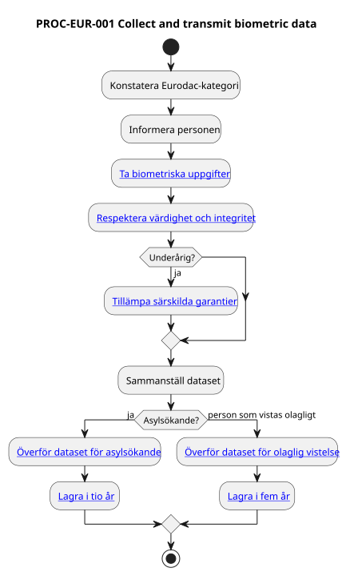

← <a href="../README.md">Eurodac</a>

# PROC-EUR-001

# Collect and transmit biometric data

## Trigger

En person omfattas av en Eurodac-kategori där biometriska uppgifter ska tas, exempelvis:

- en person som ansöker om internationellt skydd,
- en person som vistas olagligt inom en medlemsstats territorium.

---

## Resultat

Biometriska uppgifter och tillhörande dataset har tagits, överförts till Eurodac och omfattas av tillämplig lagringsperiod.

---

## Huvudflöde

Källa: [`collect-and-transmit-biometric-data.pu`](../diagrams/collect-and-transmit-biometric-data.pu)

---

## Alternativt flöde — hälsorelaterat hinder

Om biometriska uppgifter för en asylsökande inte kan tas på grund av hälsorelaterade hinder ska uppgifterna tas och överföras så snart som möjligt och senast 48 timmar efter att hindren undanröjts.

---

## Alternativt flöde — tekniskt problem

Vid allvarliga tekniska problem får 72-timmarsfristen för asylsökande förlängas med högst 48 timmar.

---

## Juridiska milstolpar

- Biometriska uppgifter tas
- Dataset överförs till Eurodac
- Dataset registreras
- Dataset lagras

---

## Regler

- [RULE-EUR-013-001](../rules/rule-eur-013-001.md) — Skyldighet att ta och lämna biometriska uppgifter
- [RULE-EUR-013-002](../rules/rule-eur-013-002.md) — Respekt för värdighet och fysisk integritet
- [RULE-EUR-014-001](../rules/rule-eur-014-001.md) — Underåriga
- [RULE-EUR-015-001](../rules/rule-eur-015-001.md) — Asylsökande
- [RULE-EUR-023-001](../rules/rule-eur-023-001.md) — Personer som vistas olagligt
- [RULE-EUR-029-001](../rules/rule-eur-029-001.md) — Lagringstid för asylsökande
- [RULE-EUR-029-002](../rules/rule-eur-029-002.md) — Lagringstid för personer som vistas olagligt

---

## Shared Activities

- [Verify identity](../../../shared/identity/activities/verify-identity.md)

---

## Diagram

Se huvudflöde ovan.
