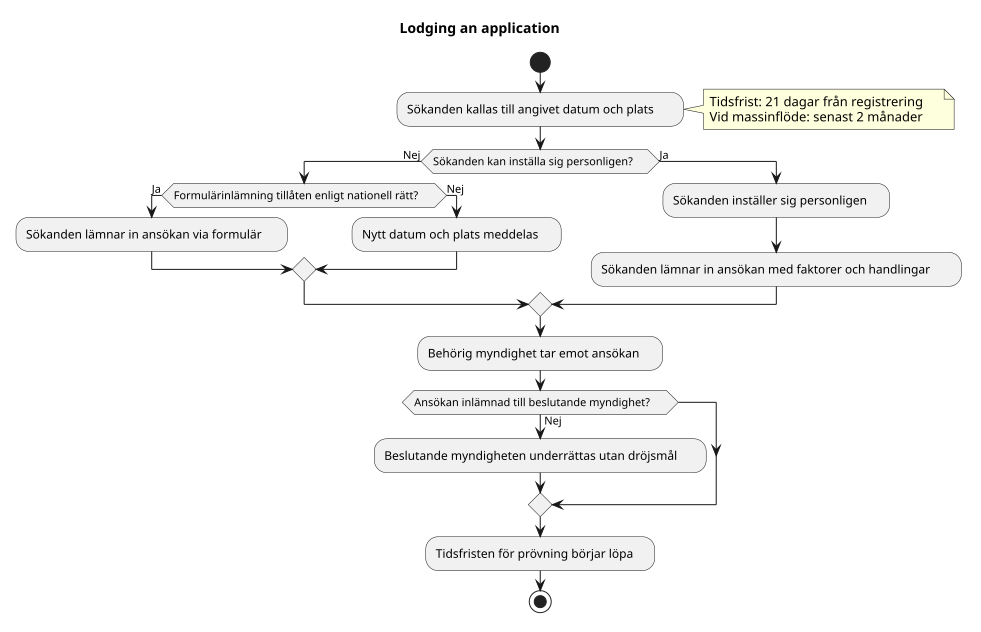

← <a href="../README.md">Registration</a>

# PROC-REG-002

# Lodging an application

## Trigger

Ansökan har registrerats och sökanden ska ges möjlighet att lämna in den.

---

## Resultat

Ansökan är inlämnad och den beslutande myndigheten har underrättats.

---

## Huvudflöde

Källa: [`lodging-an-application.pu`](../diagrams/lodging-an-application.pu)

---

## Alternativt flöde — formulär

Om sökanden inte kan inställa sig personligen på grund av fängelsestraff eller långvarig sjukhusvistelse, och om den berörda medlemsstaten har infört möjligheten i nationell rätt, får ansökan lämnas in via formulär ([RULE-APR-028-003](../rules/rule-apr-028-003.md)).

---

## Alternativt flöde — massinflöde

Om ett oproportionellt stort antal personer gör ansökan inom samma period ska sökanden ges en bokad tid senast två månader från registreringen ([RULE-APR-028-004](../rules/rule-apr-028-004.md)).

---

## Juridiska milstolpar

- Application registered
- Application lodged

---

## Regler

- [RULE-APR-028-001](../rules/rule-apr-028-001.md) — Tidsfrist för inlämnande (21 dagar)
- [RULE-APR-028-002](../rules/rule-apr-028-002.md) — Personligt inlämnande
- [RULE-APR-028-003](../rules/rule-apr-028-003.md) — Undantag: inlämnande via formulär
- [RULE-APR-028-004](../rules/rule-apr-028-004.md) — Tidsfrist vid massinflöde (2 månader)

---

## Shared Activities

- [Verify identity](../../../shared/identity/activities/verify-identity.md)

---

## Diagram

Se huvudflöde ovan.