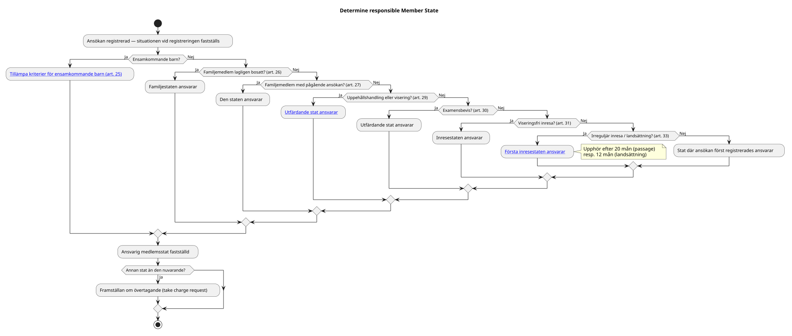

← <a href="../README.md">Responsibility</a>

# PROC-RES-001

# Determine responsible Member State

## Trigger

En ansökan om internationellt skydd har registrerats och ansvarig medlemsstat ska fastställas.

---

## Resultat

Ansvarig medlemsstat har fastställts och sökanden kan hänvisas till rätt stat för prövning.

---

## Huvudflöde

Källa: [`determine-responsible-member-state.pu`](../diagrams/determine-responsible-member-state.pu)

---

## Alternativt flöde — diskretionär bedömning

Medlemsstaten får besluta att överta prövningsansvaret av humanitära skäl oavsett kriterierna ([RULE-AMMR-035-001](../rules/rule-ammr-035-001.md)).

---

## Alternativt flöde — ansvarets upphörande

Om tidsfristerna i artikel 33 har löpt ut (20 resp. 12 månader) kan inresestaten inte längre hållas ansvarig ([RULE-AMMR-033-002](../rules/rule-ammr-033-002.md)).

---

## Juridiska milstolpar

- Application registered (referenspunkt)
- Responsible Member State determined
- Take charge request sent (om annan stat)
- Transfer decision (om annan stat)

---

## Regler

- [RULE-AMMR-024-001](../rules/rule-ammr-024-001.md) — Kriterierna i angiven ordning
- [RULE-AMMR-024-002](../rules/rule-ammr-024-002.md) — Situationen vid första registrering
- [RULE-AMMR-025-001](../rules/rule-ammr-025-001.md) — Ensamkommande barn
- [RULE-AMMR-029-001](../rules/rule-ammr-029-001.md) — Uppehållshandling eller visering
- [RULE-AMMR-033-001](../rules/rule-ammr-033-001.md) — Första irreguljära inresa
- [RULE-AMMR-033-002](../rules/rule-ammr-033-002.md) — Tidsbegränsning
- [RULE-AMMR-035-001](../rules/rule-ammr-035-001.md) — Diskretionär bedömning

---

## Shared Activities

- [Verify identity](../../../shared/identity/activities/verify-identity.md)

---

## Diagram

Se huvudflöde ovan.
